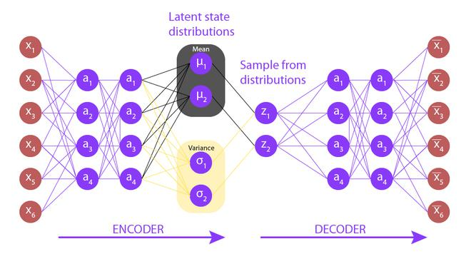
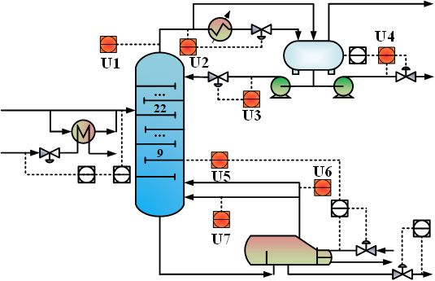
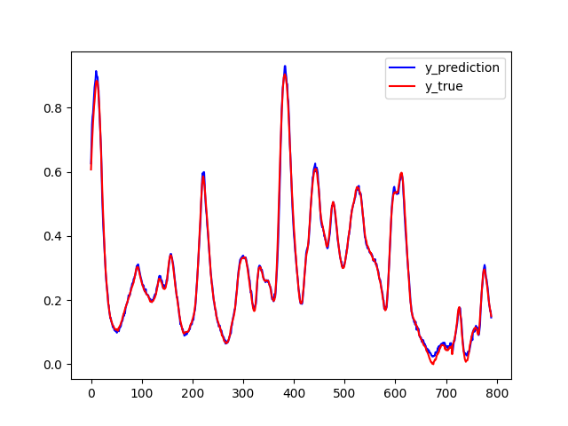
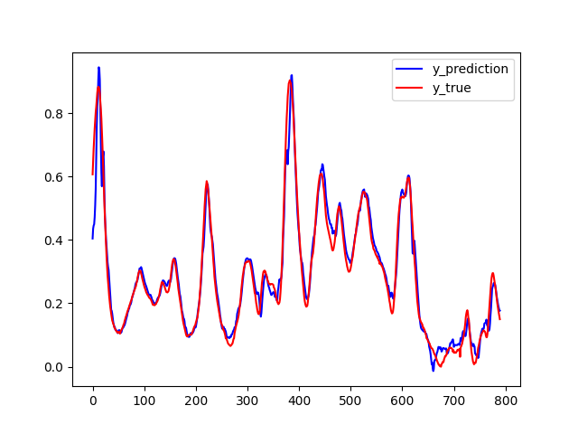
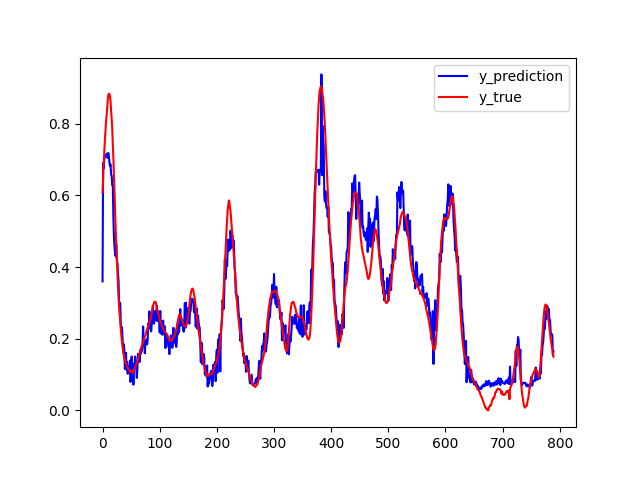

# Soft Sensor Using Gaussian Mixture Variational Auto-Encoder : Embed Unsupervised Category

## Introduction

VAE is widely used in process industry for a long time. However, these works mostly focus on the nonlinear feature, and the complex dynamic processes with multi-mode characteristics are seldomly considered. Gaussian Mixture VAE(GM-VAE) can capture the multi-mode character of process, but in the GM-VAE put-forward before, an important structure is erroneous (in the view point of Bayesian Inference). I have fixed this issue using Gumbel-Softmax reparameterization and improved the model's performance.

This work is advised by Prof. Ge at Zhejiang University. I deeply appreciate his help, and you can follow his work on Google Scholar (10k+ citations). [link](https://scholar.google.com/citations?user=g_EMkuMAAAAJ)

For those who are familiar with VAE, please directly jump to Part IV: Unsupervised Categories and Multi-mode: GM-VAE. But I strongly recommend that you read the "why we use VAE in process industry", to have some insight into our task.

## Soft Sensor

"Soft Sensor" can be viewed as the contradiction of "Hard Sensor". The principle of sensors are based on some physics laws, and modern sensors typically involve circuits. However, there are times when sensor cannot output critical variables at a higher frequency, or online. For example, in process engineering, process variables such as the concentration of product, are critical to controlling the whole process. However, we need to use methods such as liquid chromatography, which will take minutes to finish; or the process is long, and the inspection of a key process variable has a large delay. At the same time, some process variables (the pressure, the temperature) can be measured at a much higher frequency, and has correlation between these variables with those critical variables. This give rise to soft sensor: use data mining to approximate the process model, and infer the critical but hard to measure variables using accessible measurements.

One may ask: why don't directly derive the model? For many chemical processes, we can't, at least for now. As chemical processes are becoming more and more complicated, using first-principle is untractable in many cases. Instead of  "deriving" models and check them using statistical criteria, some "universal" (by universal, I mean it can approximate a large family of functions) models that converge to a set of parameters arises -- Machine Learning. This is the topic of the blog.

**Note that in the article, we use AE and VAE to represent auto-encoder and variational auto-encoder respectively. **

## Preliminaries: Bayesian Inference, VAE, and why using them

### AE

Variational auto-encoders are based on Bayesian Inference, and originated from auto-encoder, a generative unsupervised model. The idea of auto-encoder is quite simple:

The key to auto-encoder is the bottle-neck in the middle. The dimension in the middle must be smaller than that of two sides, in hope of "squeezing" the characters from datasets. The design of auto-encoder is intriguing, because it tells us something about "generative". Auto-encoder doesn't have good performance, and the structure that brings are much wider use of it are its variants: Stacked Auto-encoder (SAE), Variational Auto-encoder (VAE). 

### VAE and Bayesian Inference

VAE regards the latent variables generated by encoder as "distributions", and then sample from them. The loss of the entire system is derived using Bayesian Inference.

Denote the dataset as $D$, the latent variables as $\Omega$. $D$ is generated by $\Omega$. The key idea in Bayesian Inference is that we can estimate how close we are to the truth even if we have no knowledge about the truth. Assume there is a real distribution of the latent variables $\Omega$, which is $p(\Omega|D)$; and we infer a distribution of $\Omega$ using $D$: $q(\Omega)$ (Actually it's $q(\Omega|D)$, but we aren't going to touch the conditional distribution, so we write in a compact form). Now we need to measure the "distance" between $p(\Omega|D)$ and $q(\Omega)$. A reasonable choice is Kullback–Leibler divergence (KL Divergence in short).
$$
D_{KL}(q(\Omega)||p(\Omega|D)) = E_{q(\Omega)}(log\frac{q(\Omega)}{p(\Omega|D)})\\
=\int q(\Omega)log\frac{q(\Omega)p(D)}{p(D|\Omega)p(\Omega)}d\Omega \qquad (bayesian\ rule)\\
=D_{KL}(q(\Omega)||p(\Omega)) - \int q(\Omega)log\ p(D|\Omega)d\Omega + log\ p(D)
$$
The last term is a constant. Omit it. Define Evidence Lower Bound (ELBO) :
$$
ELBO :=-D_{KL}(q(\Omega)||p(\Omega)) + \int q(\Omega)log\ p(D|\Omega)d\Omega
$$
By maximizing ELBO, we can minimize the KL Divergence between $q(\Omega)$ and $p(\Omega|D)$. The next question is how to estimate these terms. For simplicity, assume $\Omega$ admits a conditional gaussian distribution given $D$, then the first term can be transformed into a regularization term. You can find the detailed reasoning in appendix. As for the second term, it's impossible to accurately calculate the integral here, but we can sample from the distribution of $q(\Omega)$, as we have access to the distribution because we built it! $p(D|\Omega)$ is more difficult to build, but if you still remember the structure of auto-encoder, we have built $p(\hat{D})$ using $\Omega$, thus if we assume the distribution of $\hat{D}$ admits a gaussian distribution, $p(D|\Omega)$ is estimated as well. Above all, we have estimated the distance between a distribution that we have no access to (the true distribution $p(\Omega|D)$) with something that we build ($q(\Omega)$). Very elegant, isn't it?

### Why using VAE in process industry?

The ability for a model to generate something is so attractive in vision and NLP studies, because it gives the public a sense that the model is "alive". In fact, the variants of auto-encoder, like stack auto-encoder and variational auto-encoder, are most widely used for generation tasks for image generation and speech generation, rather than discriminative tasks. But we are going to use it for a discriminative task - regression, in process industry. This is, in my opinion, related to an important ability of VAE: it's tolerance to noise. 

Typically, there are three kinds of hard sensor data being widely used to build a soft sensor, they are: thermometer, pressure gauge, and flow meter. Those who have fine-tuned a chemical process PID controller should be familiar with some principles, one of which is to use only PI instead of PID when flow meter is included in the control cycle. The noise of flow meter is related to the magnitude of flow, the temperature, and they are widely distributed in a wide range of frequencies if you perform FFT to analyze it. Here is an example, Debutanizer column. We will work on datasets drawn from the process later.

These are two flow meters' sensor readings recorded and later used one dimension of input by our model. As mentioned before, they are noisy and the noise is relevant to many factors.

## Unsupervised Categories and Multi-mode: GM-VAE

Multi-mode character is common in process industry. Though different types of soft sensor modeling techniques have been applied for quality prediction, most of them are based on the assumption that process data are generated from a single operating region and follow a unimodal Gaussian distribution. For complex multiphase/multimode processes that are running at multiple operating conditions, the basic assumption of multivariate Gaussian distribution does not met because of the mean shifts or covariance changes.

By taking sufficient linear combinations of single multivariate Gaussian distributions, Gaussian Mixture Model can smoothly approximate any continuous density to arbitrary accuracy. To use Gaussian Mixture in VAE, we have to add an additional category encoder, so the model looks like:

The derivation of ELBO is similar. Denote the category as $c$, and labels as $y$. We have:
$$
ELBO = E_{q(\Omega|D, c)q(c|D)}(log\ p(D|\Omega))\\+E_{q(\Omega|D, c)q(c|D)}(log\ p(y|\Omega))\\
-E_{q(c|D)}(D_{KL}(q(\Omega|D,c)||p(\Omega|c)))\\
-D_{KL}(q(c|D) || p(c))
$$
The details of the derivation are in the appendix. Assume the prior categorical distribution is a uniform distribution, and prior latent variable distribution is a zero norm Gaussian distribution, calculate the expectation above (tedious), we have:
$$
Loss = -ELBO=\frac{1}{N}||x-\hat{x}||^2 +\frac{1}{N}||y-\hat{y}||^2+\Sigma\ c_klog\frac{c_k}{c_k^o}+\frac{1}{2}\Sigma\ log\ \sigma^2 + 1 - \sigma^2-\mu^2
$$
The purpose of encoder is to generate latent variables for different categories. For example, when there are 5 categories, and the dimension of latent variables are 10, then encoder will output 5*10 latent variables. The selection network classifies the input and gives the probability of the category. After that, latent variables are sent to different decoders based on their categories. Finally the network **mixes** the decoder output to reconstruct the piece of data and infer the label (At the same time, using a MLP).

Everything seems fine, but it is worth noticing how the network deals with the output of encoder and selection network. Conventionally, researchers **mix** them by using a Softmax layer after the selection network and give the weighted sum of latent variables to the decoder. It is intuitive, and it works in some cases, so they didn't notice, but it's wrong, because it's against the premise: the model admits Gaussian Mixture. 

For a mixture model, we assume that the input of any instance belongs to exactly one category. The regression rule of different categories can be quite different, and we want the model to learn these different rules. In reality, the labels (in our case, the key process variables) don't come from a mixture of different models; instead, they come from exactly one model. It makes no sense at all to take the weighted sum of decoder output, and by doing that, the different regression rules we hope to estimate converges to the "mean" of these rules, as none of them could have a big difference to the final outcome when their outputs are mixed. It is confusing, because if we focus on  estimating the first two expectation terms, taking a weighted sum seems to be the right way of evaluating the expectation over a categorical distribution.

Now that it's not correct, how can we estimate the value? Just like a common practice in VAE to sample the continuous distribution generated by encoder, sampling the categorical distribution is a proper choice, and when it comes to sampling, a technique must be used: reparameterization trick. In order to back-propagate, we have to make sure the derivative of the loss to every parameter in the network can be evaluated. Assume $x$ ~ $N(\mu, \sigma)$, we can sample it from a distribution that has the same norm and variance: 
$$
x=\mu + \epsilon*\sigma\\
$$

 $\epsilon$ ~ $uniform(0, 1)$ 

So that the sampling process is differentiable.

To sample a categorical distribution, Gumbel Softmax is the tool for neural networks. It was proposed by [Eric J, et.al.](https://arxiv.org/pdf/1611.01144.pdf%20http://arxiv.org/abs/1611.01144.pdf), 2016. In short, Gumbel Softmax provides a method to draw a sample from a categorical distribution and still keeps model parameters differentiable. 

Training the model with Gumbel Softmax is harder, because it frequently leads to gradient vanish problems. After tuning the cooling rate of Gumbel softmax and many other parameters with care, the model finally worked. 

## Case Study

Let's invite our friend -- debutanizer column (DC).

| Process Variables        |            Unit           |          Description               |
| ----------------- | -------------- | ------------------------- |
| U1                | $^{\circ}C$    | Top temprature            |
| U2                | $kg * cm^{-2}$ | Top pressure              |
| U3                | $m^3 * h^{-1}$ | Reflux flowrate           |
| U4                | $m^3*h^{-1}$   | Top distillate rate       |
| U5                | $^{\circ}C$    | Temperature of 9^th^ tray |
| U6                | $^{\circ}C$    | Bottom temperature A      |
| U7                | $^{\circ}C$    | Bottom temperature B      |

The figure above presents the flowchart of the debutanizer column. Debutanizer column is an important part of the de-sulfuring and naphtha splitter plant in the refinery. As the debutanizer column is required to maximizing the pentane (C5) content in the overheads distillate and minimize the butane (C4)
content in the bottom flow simultaneously, to improve the performance of the quality control, it is
necessary to carry out the real time prediction of the butane content at the bottom flow. However, the
butane content is not directly on the bottom flow, but on the overheads of the sequential deisopentanizer
column by the gas chromatograph results in a large measuring delay.

Take the variables listed above, and train the GM-VAE proposed before. Key parameters are listed below:

Expanded Training Data dimension: 13

Latent Variable Dimension: 6

Number of Components: 4 (of Gaussian Mixture)

Volume of dataset: 2400

Batch size: 4

GM-VAE: test set prediction (R2 = 0.997)

If we still use Softmax to mix different categories, the outcome is: 

GM-VAE but without Gumbel Softmax: test set prediction (R2 = 0.948)

In contrast with the VAE without Gaussian Mixture, the R^2^ improved, and **noise** is mitigated.

Vanilla VAE: test set performance (R2 = 0.92)

We have also made a comparision between some other popular AE-based process monitor methods: Variable-Wise Weighted Stack Autoencoder, Stacked Target-related Autoencoder, Gated Stacked Target-related Autoencoder.

| Model | VW-SAE  | STAE   | GSTAE  | Multimode-VAE |
| ----- | ------- | ------ | ------ | ------------- |
| RMSE  | 0.03571 | 0.0357 | 0.0299 | 0.00728       |
| R2    | 0.9585  | 0.9518 | 0.9704 | 0.9985        |

[code]()

## Conclusion and Call for inference of Gaussian components

Gumbel softmax did make a difference (thanks to the carelessness of our predecessors). VAE suffers from strong noise in industrial datasets, and multi-mode feature in industrial processes is common. Adding the Gaussian mixture assumption and carefully build a generative mixture model make the prediction better and more practical to be deployed into factories.

But we are still wondering: how can we estimate the number of Gaussian components, or in other words, the number of modes in the process? It's difficult in practice. I have been working on an automated inference on the number of Gaussian components, by means of **Dirichlet Processes**. But the progress is not inspiring, as the model always failed to converge. I have made some attempts and here is the [code](). I am very happy to  get any advice!

## Bibliography

#### Gumbel Softmax

Jang, E., Gu, S., & Poole, B. (2016). Categorical reparameterization with gumbel-softmax. *arXiv preprint arXiv:1611.01144*. 

#### Reviews

Kingma, D. P., & Welling, M. (2019). An introduction to variational autoencoders. *Foundations and Trends® in Machine Learning*, *12*(4), 307-392.

Zhiqiang Ge. (2017). Review on data-driven modeling and monitoring for plant-wide industrial processes,
*Chemometrics and Intelligent Laboratory Systems*, Volume 171

#### Gaussian Mixture and VAE

Shao, W., Ge, Z., Yao, L., & Song, Z. (2019). Bayesian nonlinear  Gaussian mixture regression and its application to virtual sensing for  multimode industrial processes. *IEEE Transactions on Automation Science and Engineering*, *17*(2), 871-885.

Dilokthanakul, N., Mediano, P. A., Garnelo, M., Lee, M. C., Salimbeni, H., Arulkumaran, K., & Shanahan, M. (2016). Deep unsupervised clustering with gaussian mixture variational autoencoders. arXiv preprint arXiv:1611.02648.

Yuan, X., Ge, Z., & Song, Z.  (2014). Soft sensor model development in multiphase/multimode processes  based on Gaussian mixture regression. *Chemometrics and Intelligent Laboratory Systems*, *138*, 97-109.

#### Benchmarks

Yuan, X., Huang, B., Wang, Y., Yang,  C., & Gui, W. (2018). Deep learning-based feature representation and its application for soft sensor modeling with variable-wise weighted  SAE. *IEEE Transactions on Industrial Informatics*, *14*(7), 3235-3243

Sun, Q., & Ge, Z. (2020). Gated  stacked target-related autoencoder: A novel deep feature extraction and  layerwise ensemble method for industrial soft sensor application. *IEEE Transactions on Cybernetics*.

#### Dirichlet Process

Radford M. Neal, Markov Chain Sampling Methods for Dirichlet Process Mixture Models, *Journal of Computational and Graphical Statistics*, 9:2, 249-265, 2000
