# Visibility Graph Algorithm for RoboCup Small Size League

## Introduction based on Visibility

[RoboCup SSL](https://ssl.robocup.org/)  is a platform that asks participants to design robots and compete autonomously on playing soccer. Participants have to obey restrictions on robots' themselves and rules during game play. You can find details [here](). The most worth noticing facts are (for software group):

1. Robot design: a robot must fit inside a 0.18 meters wide and 0.15 meters high cylinder at any point in time. A dribbling device is permitted under certain restrictions. A vision pattern is a needed for robot identification.
2. Perception: both teams share the same vision information provided by SSL, which contains the robots' id and pose. (Extra devices are allowed, e.g., IMU) and referee instructions are sent by a software called referee box.

I am a member of ZJUNlict, the 2nd best team in the history in [hall of fame](https://ssl.robocup.org/hall-of-fame/), and probably the best team in recent 5 years. You may find this video of the race helpful, and you can find our team description paper [here](https://ssl.robocup.org/wp-content/uploads/2019/03/2019_ETDP_ZJUNlict.pdf), which can give you an overview of our hardware design and competition philosophy.

<!-- <iframe src="//player.bilibili.com/player.html?aid=375588815&bvid=BV1so4y1m7U5&cid=339262048&page=1&high_quality=1&danmaku=0" allowfullscreen="allowfullscreen" width="100%" height="500" scrolling="no" frameborder="0" sandbox="allow-top-navigation allow-same-origin allow-forms allow-scripts"></iframe> -->

<iframe src="//player.bilibili.com/player.html?aid=970397167&bvid=BV18p4y1r7Vm&cid=258810918&page=1" scrolling="no" border="0" frameborder="no" framespacing="0" allowfullscreen="true" width="100%" height="500" scrolling="no" frameborder="0" sandbox="allow-top-navigation allow-same-origin allow-forms allow-scripts"> </iframe>

<!-- <video src="https://www.bilibili.com/video/BV18p4y1r7Vm"> -->

In this blog I will talk about path planning in SSL and propose a mapping & planning method to address the problem better. Of course, path planning is not the main challenge in the environment. But in my opinion, there are two drawbacks of current algorithm: RRT\*. First, the sampling process in RRT* is inefficient in a very sparse environment in SSL matches, as there are only limited kind and number of obstacles on the field. Second, RRT* is asymptotically optimal, which is harmful to decision in some circumstances. Take a look at the figure below. 

	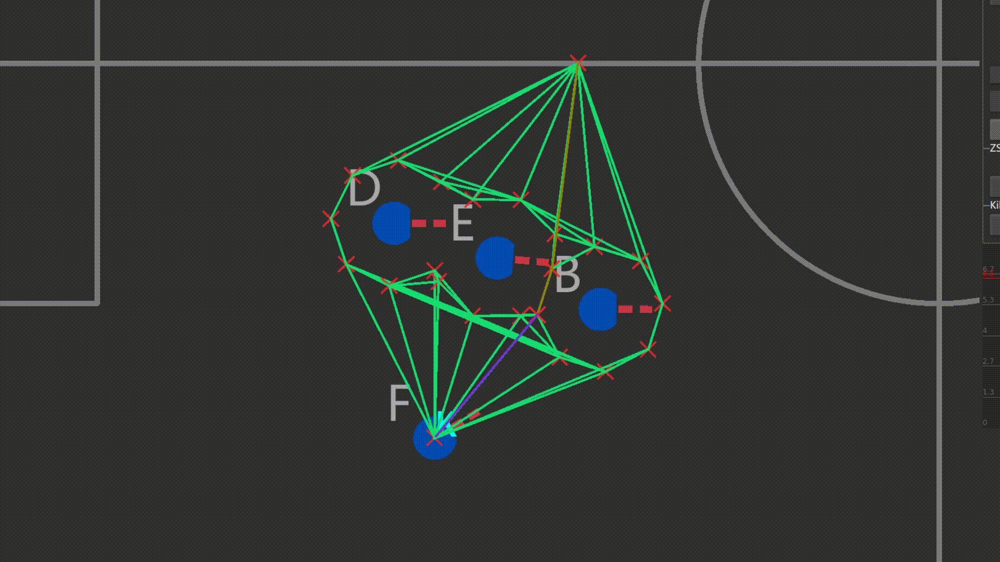
	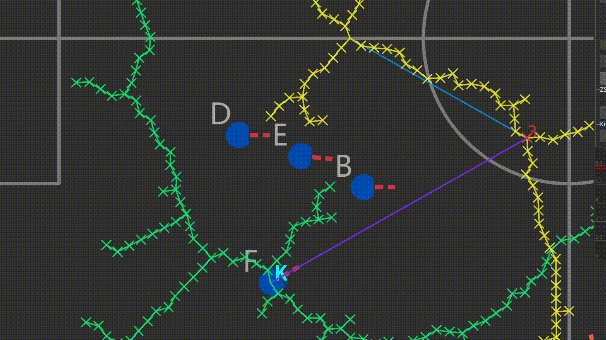

The former is proposed, and the latter is RRT*. The outcome of RRT* is not always the same as it samples the field, but in this occasion, which is pretty common in matches (imagine other cars are defending the **F** car), this outcome occurs frequently. But if we build the graph based on visibility, we can get an almost optimal path in a deterministic algorithm. By the way, it is also much more efficient, and we may compare the planning time of RRT* and my proposed algorithm in the above circumstance:

| RRT\* (averaging 31 plannings) | Proposed(averaging 31 plannings) |
| --------------------------     | ---------------------------- |
| 2.338 ms                   | 0.411 ms                     |

The next part introduces the details of proposed mapping and planning algorithm.

## Mapping & Planning Algorithm

### Problem Formulation

Given an initial position $I$, a target position $G$, a finite map $M$. Output a path $P$ in the map $M$ so that when the robot follows $P$, it can reach the target position $G$ and avoid collision with obstacles on $M$.

### Mapping details

The mapping & planning module could receive the pose of all the robots on the field, also the state of race (e.g., ball placement, penalty, or normal state). The module plan the path of each robot separately, i.e., one robot at a time. I do not use a grid map here; keep it in mind that there are only 3 kinds of obstacles in the field, I suggest we should represent them in the minimal representation of the geometric shapes below: (obstacles are drawn in green lines below)

1. Circles, for robots

   

2. Rectangles, for the penalty area (robots are not allowed in penalty except the goalie)

   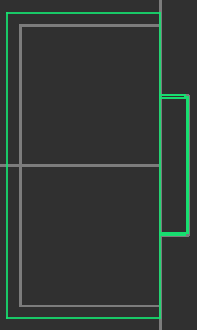

3. Long circle, for ball placement restricted area (During [ball placement](https://robocup-ssl.github.io/ssl-rules/sslrules.html#_ball_placement) state, all robots of the non-placing team have to keep at least 0.5 meters distance to the line between the ball and the placement position)

   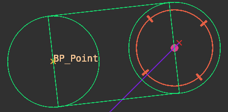

   

### Planning details

We can detect if a robot will collide the above geometric shapes when: a. moving on a line segment in the field; b. at a certain position. We can do this in O(1) by checking the minimal distance between the robot and the geometric shape. The planning algorithm stores points as a graph using a KD Tree.

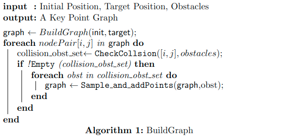

Please do note that "Sample_and_addPoints" function will make changes to the graph, so the number of nodePairs also changes in the outer loop. Here is the detail of $Sample\_and\_addPoints$:

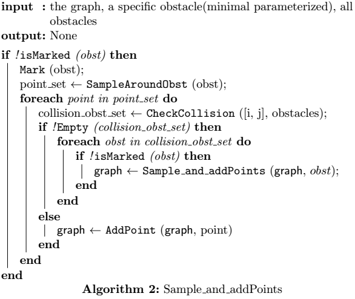

This is expressed in recursion for convenience. This algorithm will first check if the obstacle is marked (to make sure this will stop), then sample around the obstacle, and check each sampled point whether it will lead to collision with any other obstacles. If not, add the point to the graph; if it leads to collision, check each obstacle that the point collides with whether they are marked. If they aren't marked, call the algorithm recursively on it. 

The BuildGraph algorithm aims to achieve the following goal:

> For any pair of nodes in the graph, either the edge between them is collision-free, or the obstacles that could cause collision are sampled. 

Here is an example. The graph is marked in green, the target is always the point at right.

Assume **F** car is going to the point connected with purple line:

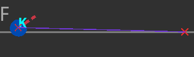

Then **B** car got on its way. The direct path will certainly lead to collision, so add **B** car to obstacle and sample around it:

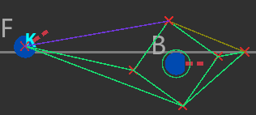

**E** car comes and covers one of the point in the graph above. Add **E** car to obstacle as well. 

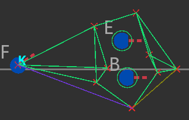

**A** car then comes and stands on one of the lines of the graph above. Add **A** car to obstacle and sample it. Because it's very close to **F**, increase the sampling rate from 4 to 8. As you can see, the algorithm tried able to get the the point around **E** exactly in the same way as trying getting to the target, as in step 2.

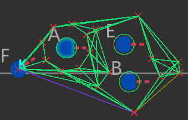

To have some insight on the algorithm, you can think this way: the algorithm tries to take a straight path to its target, and if she finds it impossible, she finds a point around the obstacle in order to avoid the obstacle. The whole process is close to building a visibility graph, but the recursion process could get rid of a lot of points that are not necessary. 

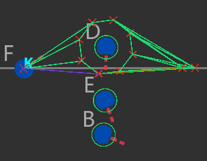

 In this case, there's no need to consider E and B.

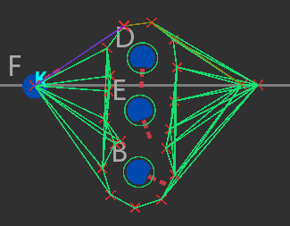

Slightly move E upwards and cover one sampling point around D, then E and B will be added.

We choose the following sampling method: For circles, sample four points evenly around them when it's far away (>1000mm) and six points around them when it's near. For rectangles, imagine a similar expand and take four corners of the expanded rectangle. For long circle, combine two circles and the algorithm will automatically get rid of the points in the long circle. This is tested by a wide range of experiments, and they outperform RRT\* in most cases.

## Control, Trajectory, and Dynamic Safety Search

As for execution, a trajectory optimization is actually unnecessary. We use a direct method instead: make the robot follow the straight line path using trapezoidal velocity planning and guarantee  the replan frequency is high enough. That's because the vehicle supports omni-directional movement, so the lack of trajectory optimization would just do a little harm to the overall performance. 

However, there is one thing worth considering: the environment on the field is highly dynamic. Proper compensation should be made. One idea is to extend the circle obstacles to long circles, according to their speeds. This way seeks to solve the problem in planning phase. In practice, we adopt the dynamic safety search method. I will briefly summarize the idea below.

Dynamic safety search is centralized, so there is a "central" robot that we can control and we assume any other obstacles(including the teammates) cannot be controlled. It first looks for the obstacles (specifically, circles) that is within a certain range. (To avoid unnecessary searches) Then it samples uniformly in the direction of the obstacles'  acceleration, and checks whether after a short period the obstacle will lead to a crash given the robot's path. If it does lead to a collision, we will add a compensation on the robot's velocity command, which is also generated by sampling in the direction of the robot's acceleration. Dynamic safety search is time consuming because if we look for a more precise compensation of speed, then we must raise the sampling rate. 

## Experiment and Conclusion

Here is a clip of a simulated match. The debug module is time consuming, thus it is not applicable to draw the graph during any real match. (Both teams use the same multi-robot strategy and planning algorithms) The graph of different robots are drawn in different colors. The ball is the little pink circle, and the planning time (averaged) are at the right corner (ms, counts).

I turned off other debug options as our focus here is the mapping algorithm. It appears to be quite messy, and quickly leads to our thinking about we can do the search on the same graph. Unfortunately, making this change require a lot of changes on the framework, and still haven't been inplemented.

Compared it with RRT* and A*, on the same computer (i7-9750U). These are results from 10,000 times plannings with 12 agents playing  in the same environment. 

| RRT* (averaged 10,000) | Proposed (averaged 10,000) |
| ---------------------- | -------------------------- |
| 0.43 ms                | 2.61 ms                    |

Apparently, the proposed algorithm becomes inefficient when the number agent increases, but it suffices to deal with the challenges in RoboCup SSL matches. And we have been using it in the 2022 Zhejiang Provincial RoboCup matches. It performed well.

From the experiments above, we can draw the conclusion that the proposed algorithm meets the need of SSL and outperforms standard planning algorithms such as RRT*. 

