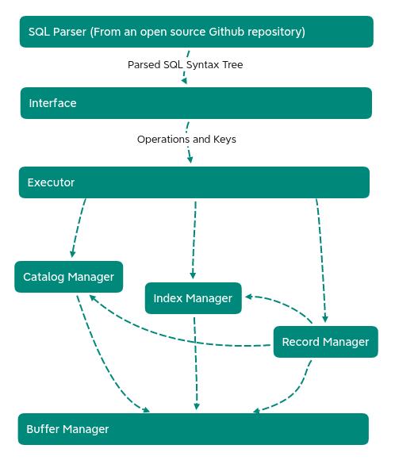

TinySQL is a database management system supporting SQL. The project is self contained and designed originally. Guofei Chen was the architect of the project, as well as the code reviewer.

Here let's briefly talk about the design details of this SQL project.

Download the Chinese technical report.

## Architecture

This is the architecture of the database. **The meaning of arrow is: If A->B, then A module will use functions and classes in B module.** To have a detailed understanding of the relations between modules, please refer to our documentation.

The duty of different modules:
Interface: Deal with the syntax tree given by SQL-Parser，judge the exact operation type of the command（e.g., create，select, etc.) Transfer the table name, the attribute to project on, and the key value to look for. Give them to the executor.

Executor: Determine the execution order, and finish atomic operations.

Catalog Manager: Manage the basic information of table, including its name, attributes, whether there are indexes on certain attribute, etc.

Index Manager : Manage the index file store on the disk. To be specific, we use B+ tree for index.

Record Manager : Manage the data of different tables. We store different tables in different files and use row-based mechanism to design the file structure.

Buffer Manager : Manage the data stored in cache(memory) and its relation with disk files. For modules above, "files" and "memory" are invisible.

## An overview of important design details
1. This is a row-based database, and use tuple to manage files. We delete records lazily and optimize the file on a regular basis to constrain its size.
2. Storage mechanisms: 
   a. Record Manager: Tables are stored seperately in different binary files. Pages in the file is constrained to be 4KB.
   b. Index Manager: Indexes are stored seperately in different binary files. The structure of a page is:
   | BlockType (4) | ParentBlockId(4) | CurrentSize (4) | MaxSize (4) | ParentBlockId (4) | BlockId(4) | key-id pairs... (to 4096B)
   c. Catalog Manager: A string file stores the information of each table. The information can be decoded by catalog manager, and is readable (to some extent).
3. We only support data records that are smaller than 4KB, which is a page size.
4. An external parser is used in source code. You can find their work [here](https://github.com/hyrise/sql-parser)

<!-- ## Some Examples:

### 

### Select

###  -->

## Please star our project on github if you like it!
